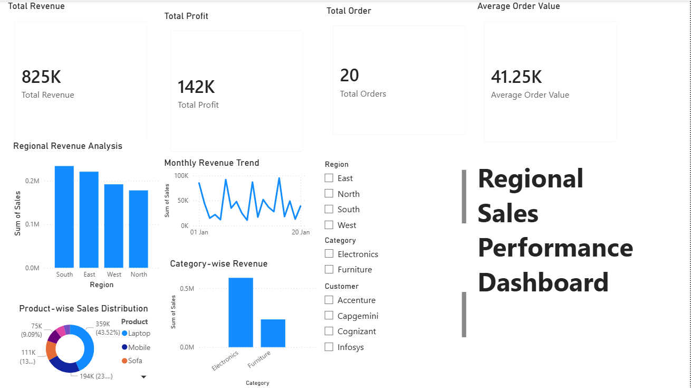

# TA Operations Reporting Dashboard | Power BI

## Project Overview
Interactive Power BI dashboard for Talent Acquisition KPI tracking,
recruiter performance monitoring, and hiring pipeline analysis.

## Dashboard Preview

## Key KPIs Tracked
- Total Candidates: 12
- Joined Candidates: 5
- Average Time to Hire: 8.56 days
- Offer Released Candidates: 2

## Features
- Department-wise Hiring Distribution (IT, Finance, HR, Sales)
- Recruiter-wise Candidate Pipeline (Rahul, Amit, Sneha, Pooja)
- SLA Adherence Status (Met, Pending, Breached)
- Candidate Status breakdown (Joined, Interview, Offer Released, Screening)
- Interactive Slicers — Department, Recruiter, Location, Status
- Dynamic KPI cards with DAX measures

## Tools Used
- Power BI Desktop (DAX, Slicers, KPI Cards, Charts)
- E
